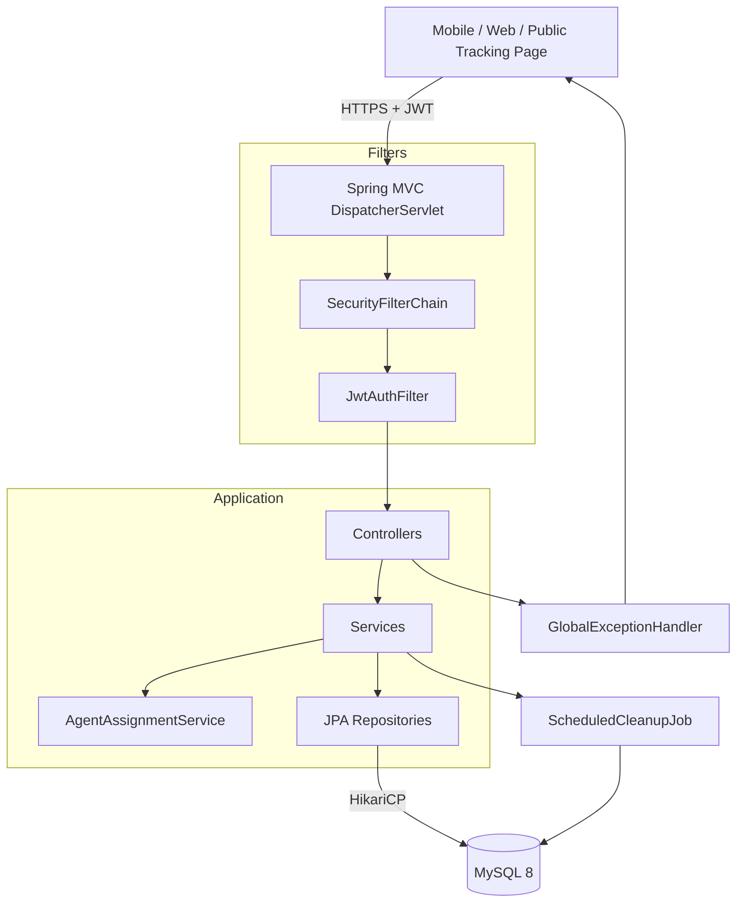

# Architecture

Verified against the real `src/main/java/com/hyperlocal/delivery` tree on
2026-09-29 — the package listing below previously predated the OTP
registration/reset flow (Phase 05) and the agent-invite flow (Phase 11);
both are now reflected.

## Request flow



## Tech stack

- **Language:** Java 17
- **Framework:** Spring Boot 4.1 (WebMVC, Security, Data JPA, Validation, Actuator)
- **Database:** MySQL 8 with Flyway migrations (V1-V10, see `docs/concepts/schema-versioning.md`)
- **Auth:** JWT (HS256) with refresh-token rotation (SHA-256 hashed at rest)
- **API Docs:** SpringDoc OpenAPI 2.6 (Swagger UI at `/swagger-ui.html`)
- **Build:** Maven with Spring Boot plugin
- **Deploy:** Railway (Procfile-based), binds to `$PORT` dynamically in the `prod` profile

## Four hard engineering problems

### 1. Concurrent auto-assignment with pessimistic locking

When a shipment is created, the system auto-assigns it to the agent with
the fewest active shipments. Under concurrent requests, two shipments
could be assigned to the same "least loaded" agent. This is solved with a
`SELECT ... FOR UPDATE` pessimistic row lock on the agent query,
serializing assignment within a transaction.

### 2. Strict state machine with an immutable audit trail

Shipments are auto-assigned on creation and start life already `ASSIGNED`
— there is no `CREATED` status. From there, agents move a shipment forward
one step at a time:
`ASSIGNED → PICKED_UP → IN_TRANSIT → OUT_FOR_DELIVERY → DELIVERED | FAILED | RETURNED`.
`DELIVERED`, `RETURNED`, and `CANCELLED` are terminal for every role — no
transition out, for anyone. `FAILED` is terminal for the agent, but the
owner may reassign a `FAILED` shipment back to `ASSIGNED`. The owner can
also cancel any non-terminal shipment outright (`→ CANCELLED`) and
permanently delete a `CANCELLED` shipment (removing its history and
tracking link). Invalid transitions are rejected with a 422 error. Every
transition, including a non-terminal agent reassignment (where the status
doesn't change but the agent does), appends an immutable `ShipmentEvent`
record — the history can never be rewritten (deleting a `CANCELLED`
shipment is the one operation that removes event history, and only after
the shipment has already reached that terminal state).

### 3. Secure refresh token rotation

Refresh tokens are SHA-256 hashed before storage (never stored in
plaintext). On each use, the old token is revoked and a new one issued. A
scheduled job purges expired tokens. This prevents token replay attacks
even if the database is compromised.

### 4. OTP-gated registration and password reset, with non-disclosure

Registration is two-step: `POST /auth/register` creates a `PendingRegistration`
row and emails an OTP, but does not create the `User` yet; only
`POST /auth/verify-registration-otp` actually creates the account and
issues tokens. Password reset follows the same OTP shape:
`forgot-password` (send OTP) → `verify-reset-otp` (exchange a valid OTP for
a short-lived, 5-minute JWT reset-session token) → `reset-password`
(redeem that token). Both flows return identical responses whether or not
the target email exists, to avoid leaking which addresses are registered.
`OtpRateLimiter` and `RegistrationRaceGuard` guard against abuse and
concurrent-registration races on the same email.

## Project structure

This is a single repo containing both halves of the app: the Spring Boot
backend at the root, and a Vite/React frontend in `frontend/`. `mvn package`
builds the frontend (`npm install && npm run build` via the
`frontend-maven-plugin`) straight into `src/main/resources/static`, so one
JAR serves both — no separate frontend deploy.

```
frontend/               Vite/React SPA — owner, agent, and public
                        customer-tracking pages (see frontend/README.md)
src/main/java/com/hyperlocal/delivery
├── DeliveryApplication.java   ← @SpringBootApplication entry point
├── config/             SecurityConfig, OpenApiConfig, SchedulingConfig, CorsConfigProperties,
│                       WebConfig, MailConfig, MailProperties, ShipmentStatusConverter, StartupValidator,
│                       HealthController
├── controller/         AuthController, AgentController, ShipmentController,
│                       DeliveryAttemptController, PublicTrackingController, AnalyticsController,
│                       ReportController, SpaFallbackController
├── service/            AuthService, AgentService, AgentAssignmentService, AgentInviteService,
│                       ShipmentService, DeliveryAttemptService, AnalyticsService,
│                       OtpService, OtpRateLimiter, LoginRateLimiter, RegistrationRaceGuard,
│                       MailLinkBuilder,
│                       OtpEmailService (interface), ConsoleOtpEmailService, SmtpOtpEmailService,
│                       AgentInviteMailer (interface), ConsoleAgentInviteMailer, SmtpAgentInviteMailer,
│                       ScheduledCleanupJob
├── repository/         BusinessRepository, UserRepository, ShipmentRepository,
│                       ShipmentEventRepository, DeliveryAttemptRepository, RefreshTokenRepository,
│                       OtpRecordRepository, PendingRegistrationRepository, AgentInviteRepository,
│                       ShipmentSpecifications
├── model/              Business, User, Shipment, ShipmentEvent, DeliveryAttempt,
│                       RefreshToken, OtpRecord, PendingRegistration, AgentInvite,
│                       ShipmentStatus, ShipmentStatusSets, UserRole, FailureReason,
│                       OtpPurpose, OtpStatus
├── dto/
│   ├── auth/           RegisterRequest, LoginRequest, RefreshRequest, AuthResponse,
│   │                   UserResponse, TokenRefreshResponse, ForgotPasswordRequest,
│   │                   ResetPasswordRequest, UpdateAccountRequest, VerifyOtpRequest,
│   │                   ResendOtpRequest, OtpSentResponse, OtpErrorResponse,
│   │                   ResetTokenResponse, PendingRegistrationPayload
│   ├── agent/          CreateAgentRequest, UpdateAgentRequest, AgentResponse, AgentSummaryDto
│   ├── invite/          InviteResponse, InvitePreviewResponse, AcceptInviteRequest
│   ├── shipment/       CreateShipmentRequest, AdvanceRequest, ReassignRequest, CancelShipmentRequest,
│   │                   ShipmentResponseDto, ShipmentSummaryDto, ShipmentEventDto,
│   │                   DeliveryAttemptDto, AgentMiniDto
│   ├── attempt/        CreateAttemptRequest, FailAttemptRequest
│   ├── tracking/       PublicTrackingResponse
│   ├── analytics/      OverviewResponse, AgentStats, DailyVolume, FailureReasonStat
│   ├── reports/        OverviewReportDto, TrendReportDto, AgentPerformanceRowDto,
│   │                   RegisterRowDto, RegisterInspectDto, DayPointDto, AgentBarDto, ReasonCountDto
│   └── common/         ApiSuccess, ApiSuccessPage, ApiError, Pagination
├── exception/          GlobalExceptionHandler, DomainException, ErrorCode,
│                       DuplicateEmailException, InvalidCredentialsException,
│                       InvalidRefreshTokenException, InvalidResetTokenException,
│                       ForbiddenException, AgentNotFoundException, ShipmentNotFoundException,
│                       ValidationException, InvalidStateTransitionException,
│                       InvalidStateForDeleteException, AgentHasActiveShipmentsException,
│                       NoAgentsAvailableException, InvalidAgentException,
│                       InvalidStateForAttemptException, RateLimitExceededException,
│                       OtpVerificationException, InvalidInviteTokenException, MailDeliveryException
├── security/           JwtUtil, JwtProperties, JwtAuthFilter, CustomUserDetails, CustomUserDetailsService,
│                       JwtAuthenticationEntryPoint, AuthenticatedPrincipal, PublicApiPaths
└── util/               ResponseBuilder, TrackingTokenGenerator, TimeUtils, CsvExportWriter
```

Notes on classes that no longer exist (previously listed here, removed
after verifying against the real tree):

- `PasswordResetToken` / `PasswordResetTokenRepository` — the V3
  migration's `password_reset_tokens` table was dropped by V6, and the
  reset flow is now OTP + JWT-session-token based (see "Four hard
  engineering problems" #4 above), not a persisted reset-token row.
- `PasswordResetMailer` / `ConsoleMailService` / `SmtpMailService` — this
  interface pair was the link-based reset flow's mailer, left wired up in
  `MailConfig` and injected into `AuthService` after the OTP rewrite made
  it unreachable. Verified unused (2026-09-29) and removed, along with the
  now-dead `RESET_LINK_BASE_URL`/`RESET_TOKEN_TTL_MINUTES` config keys.
  `MailLinkBuilder` stayed — its `buildInviteLink` method is still real,
  shared with the agent-invite mailers.
