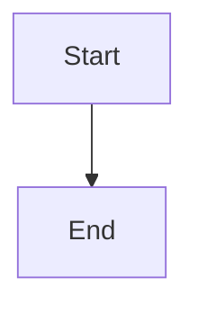

# Documentation Standard — LOCKED

How every task document and concept file in this guide is organised.
This file is the format bible — every doc writer (human or AI) must
follow it exactly.

---

## 1. Folder Structure

```
docs/
├── DOCS-OVERVIEW.md                   entry point — all phases at a glance
├── PROGRESS.md                        one checkbox per task; your position in the guide
├── DOC-STANDARD.md                    this file — locked format rules
├── REWRITE-PLAN.md                    the master plan — decisions, progress tracker
│
├── concepts/                          universal technology explanations (~23 files)
│   ├── spring-boot-and-autoconfiguration.md
│   ├── build-tools-and-maven.md
│   ├── yaml-and-externalized-configuration.md
│   ├── database-migrations-and-flyway.md
│   ├── environment-variables.md
│   ├── version-control-basics.md
│   ├── schema-versioning.md
│   ├── jpa-entity-mapping.md
│   ├── entity-relationships.md
│   ├── spring-data-repositories.md
│   ├── soft-delete.md
│   ├── password-hashing-bcrypt.md
│   ├── jwt-structure.md
│   ├── jwt-access-vs-refresh.md
│   ├── spring-security-filter-chain.md
│   ├── dto-vs-entity.md
│   ├── bean-validation.md
│   ├── exception-to-http-status.md
│   ├── otp-verification.md
│   ├── state-machines.md
│   ├── specifications-and-dynamic-queries.md
│   ├── pagination.md
│   └── cors.md
│
├── reference/                         lookup tables you keep open while building
│   ├── api-contract.md
│   ├── db-schema.md
│   ├── error-codes.md
│   └── glossary.md
│
├── phase-00-setup/                    9 tasks
│   ├── 00-task-breakdown.md
│   ├── task-01-install-jdk.md
│   ├── task-02-install-maven.md
│   ├── task-03-install-mysql.md
│   ├── task-04-install-intellij.md
│   ├── task-05-install-git.md
│   ├── task-06-install-node.md
│   ├── task-07-install-postman.md
│   ├── task-08-create-github-repo.md
│   └── task-09-verify-all.md
│
├── phase-01-project-init/             9 tasks
│   ├── 00-task-breakdown.md
│   ├── task-01-generate-spring-project.md
│   ├── task-02-open-in-intellij.md
│   ├── task-03-understand-structure.md
│   ├── task-04-add-dependencies.md
│   ├── task-05-create-mysql-database.md
│   ├── task-06-configure-application-yml.md
│   ├── task-07-set-environment-variables.md
│   ├── task-08-flyway-migration-folder.md
│   └── task-09-first-run-and-commit.md
│
├── phase-02-database-schema/          10 tasks
│   ├── 00-task-breakdown.md
│   ├── task-01-study-schema-on-paper.md
│   ├── task-02-create-businesses-table.md
│   ├── task-03-create-users-table.md
│   ├── task-04-create-shipments-table.md
│   ├── task-05-create-events-attempts-tokens.md
│   ├── task-06-create-otp-tables.md
│   ├── task-07-add-phone-and-integrity.md
│   ├── task-08-enable-flyway-and-run.md
│   ├── task-09-verify-in-dbeaver.md
│   └── task-10-commit.md
│
├── phase-03-jpa-entities/             19 tasks
│   ├── 00-task-breakdown.md
│   ├── task-01-create-packages.md
│   ├── task-02-create-shipment-status-enum.md
│   ├── task-03-create-user-role-enum.md
│   ├── task-04-create-failure-reason-enum.md
│   ├── task-05-create-otp-enums.md
│   ├── task-06-create-business-entity.md
│   ├── task-07-create-user-entity.md
│   ├── task-08-create-shipment-entity.md
│   ├── task-09-create-shipment-event-entity.md
│   ├── task-10-create-delivery-attempt-entity.md
│   ├── task-11-create-refresh-token-entity.md
│   ├── task-12-create-otp-record-entity.md
│   ├── task-13-create-pending-registration-entity.md
│   ├── task-14-enable-ddl-validate.md
│   ├── task-15-create-business-repository.md
│   ├── task-16-create-user-repository.md
│   ├── task-17-create-shipment-repository.md
│   ├── task-18-create-remaining-repos.md
│   └── task-19-verify-and-commit.md
│
├── phase-04-security-jwt/             10 tasks
│   ├── 00-task-breakdown.md
│   ├── task-01-jwt-properties.md
│   ├── task-02-jwt-util.md
│   ├── task-03-authenticated-principal.md
│   ├── task-04-custom-user-details.md
│   ├── task-05-custom-user-details-service.md
│   ├── task-06-jwt-entry-point.md
│   ├── task-07-jwt-auth-filter.md
│   ├── task-08-security-config.md
│   ├── task-09-login-rate-limiter.md
│   └── task-10-verify-and-commit.md
│
├── phase-05-auth-and-otp/             14 tasks
│   ├── 00-task-breakdown.md
│   ├── task-01-otp-rate-limiter.md
│   ├── task-02-otp-validation-result.md
│   ├── task-03-otp-service-generate.md
│   ├── task-04-otp-service-validate.md
│   ├── task-05-otp-email-service.md
│   ├── task-06-smtp-otp-email-service.md
│   ├── task-07-password-reset-mailer.md
│   ├── task-08-auth-dtos.md
│   ├── task-09-auth-service-register.md
│   ├── task-10-auth-service-login.md
│   ├── task-11-auth-service-password-reset.md
│   ├── task-12-auth-controller.md
│   ├── task-13-global-exception-handler.md
│   └── task-14-verify-and-commit.md
│
├── phase-06-agent-management/         9 tasks
│   ├── 00-task-breakdown.md
│   ├── task-01-shipment-status-sets.md
│   ├── task-02-agent-assignment-service.md
│   ├── task-03-agent-dtos.md
│   ├── task-04-agent-service-crud.md
│   ├── task-05-agent-service-deactivate-reactivate.md
│   ├── task-06-agent-controller.md
│   ├── task-07-agent-exceptions.md
│   ├── task-08-verify-and-commit.md
│   └── task-09-test-endpoints-postman.md
│
├── phase-07-shipment-lifecycle/       12 tasks
│   ├── 00-task-breakdown.md
│   ├── task-01-tracking-token-generator.md
│   ├── task-02-shipment-specifications.md
│   ├── task-03-shipment-dtos-request.md
│   ├── task-04-shipment-dtos-response.md
│   ├── task-05-shipment-service-create.md
│   ├── task-06-shipment-service-advance.md
│   ├── task-07-shipment-service-reassign.md
│   ├── task-08-shipment-service-queries.md
│   ├── task-09-shipment-controller.md
│   ├── task-10-public-tracking-controller.md
│   ├── task-11-shipment-exceptions.md
│   └── task-12-verify-and-commit.md
│
├── phase-08-delivery-attempts/        6 tasks
│   ├── 00-task-breakdown.md
│   ├── task-01-attempt-dtos.md
│   ├── task-02-delivery-attempt-service.md
│   ├── task-03-delivery-attempt-controller.md
│   ├── task-04-fail-endpoint-integration.md
│   ├── task-05-attempt-exception.md
│   └── task-06-verify-and-commit.md
│
├── phase-09-analytics-reports/        10 tasks
│   ├── 00-task-breakdown.md
│   ├── task-01-analytics-dtos.md
│   ├── task-02-analytics-queries.md
│   ├── task-03-analytics-service-overview.md
│   ├── task-04-analytics-service-agents-trend.md
│   ├── task-05-analytics-controller.md
│   ├── task-06-report-dtos.md
│   ├── task-07-report-controller.md
│   ├── task-08-csv-export.md
│   ├── task-09-time-utils-response-builder.md
│   └── task-10-verify-and-commit.md
│
├── phase-10-production-readiness/     7 tasks
│   ├── 00-task-breakdown.md
│   ├── task-01-scheduled-cleanup-job.md
│   ├── task-02-startup-validator.md
│   ├── task-03-frontend-placeholder.md
│   ├── task-04-spa-fallback-controller.md
│   ├── task-05-health-endpoint.md
│   ├── task-06-openapi-webconfig-cors.md
│   └── task-07-final-commit.md
│
│
├── phase-11-agent-invites/            6 tasks
│   ├── 00-task-breakdown.md
│   ├── task-01-create-agent-invites-table.md
│   ├── task-02-create-agent-invite-entity.md
│   ├── task-03-agent-invite-mailer.md
│   ├── task-04-agent-invite-service.md
│   ├── task-05-invite-endpoints.md
│   └── task-06-verify-and-commit.md
├── DRIFT-LEDGER.md                    code changes that could invalidate a doc
├── SYSTEM-ARCHITECTURE.md             diagrams of the finished system
└── AUDIT-PROMPT.md                    standing prompt for docs-vs-code audits
```

---

## 2. The Concepts Folder

### What Belongs In It

**The test: would this explanation be word-for-word identical in a completely
different Spring Boot project?**

- **Yes → it is a concept.** JWT structure, BCrypt, `@Transactional`, the Spring
  Security filter chain, JPQL, pagination, N+1 queries, OTP verification patterns.
- **No → it stays in the task file.** Anything naming YOUR tables, YOUR classes,
  YOUR methods, YOUR specific configuration choices.

### Concept File Template

```markdown
# <Concept Name>

**One-liner:** <the entire concept in one sentence>

## Concept Explanation
2-3 LONG flowing paragraphs explaining what it is, why it exists,
how it works, and where it is used. Written in plain English so a
complete beginner understands without prior knowledge. Every technical
term explained the moment it is introduced. A real-life analogy woven
in naturally.

## Subtopics
(Only if the concept has types / components / layers / steps.)
Each subtopic gets its own heading with a full paragraph of explanation.
No bullet points in this section — flowing paragraphs only.

## Diagram
Mermaid diagram (rendered natively in IntelliJ dark mode, Obsidian,
GitHub, VS Code). Use fenced code blocks with ```mermaid language tag.
NO ASCII ART. NO embedded images. Pure Mermaid only.

Diagram types to use:
- `flowchart TD` — for pipelines, request flows, startup sequences
- `erDiagram` — for database relationships
- `sequenceDiagram` — for HTTP request/response flows
- `classDiagram` — for class/interface relationships
- `stateDiagram-v2` — for state machines (shipment lifecycle)

Only include when it genuinely adds clarity. Not every concept needs one.

## The Smallest Code Example
5-10 lines of GENERIC code (not project-specific) showing the concept
in its simplest possible form. Annotated with comments explaining each line.

## In This Project
How this concept appears in YOUR hyperlocal delivery backend.
Walk through a real scenario from this project step by step.
Name the actual files, classes, methods where it shows up.
3-5 lines connecting theory to practice.

## Key Points
- 5-8 bullets for quick reference
- One-line definitions of important terms introduced above
- Common mistakes beginners make
- Interview-relevant facts

## Where You'll Use This
| Phase | Task | What you'll do with this concept |
|-------|------|----------------------------------|
| ...   | ...  | ...                              |
```

### Concept File Targets

- **250–400 lines** per file
- **1400–1800 words** of flowing prose
- Comprehensive, paragraph-based, beginner-friendly
- A concept that needs 600+ lines should be split into two files

### Naming

Lowercase, hyphenated, no phase numbers: `password-hashing-bcrypt.md`, not
`phase-04-bcrypt.md`. A concept outlives the phase that first needed it.

---

## 3. The Task Document

Eight blocks, in this order, in every task. The order never varies.

```markdown
# Task NN — <Verb + what you build>

|               |                                              |
|---------------|----------------------------------------------|
| **Type**      | Build/Wire/Checkpoint/Learn · ~NN min        |
| **Needs**     | Task XX (what must be verified first)        |
| **Touches**   | Exact file paths created or edited           |
| **Done when** | One objectively checkable sentence           |

## 1. What and why
## 2. Concepts you need
## 3. Build it
## 4. The finished code
## 5. Verify
## 6. If it breaks
## 7. What you learned
## 8. Next
```

### Block 0 — Header Table

Four rows, always the same, always in this order.

| Row | Contains |
|---|---|
| **Type** | `Build` (code that makes something work) · `Wire` (config, deps, migrations) · `Checkpoint` (phase-end verify + commit) · `Learn` (study, no code output), plus a time estimate |
| **Needs** | The exact prior task(s) that must be *verified*, not merely read |
| **Touches** | Every file this task creates or edits, by path |
| **Done when** | One objectively checkable sentence |

### Block 1 — What and Why

Two to three paragraphs in flowing prose:

1. What works after this task that did not before.
2. Why this task exists — what breaks without it.
3. Context for a beginner (where it fits, what depends on it).

Written in simple language, paragraph form. Assume the reader is building
their first Spring Boot project.

### Block 2 — Concepts You Need

**Links only. No explanations.** If you are writing prose here, it belongs
in a concept file.

```markdown
- [Password hashing and BCrypt](../concepts/password-hashing-bcrypt.md) — read first, ~5 min
- [@Transactional](../concepts/transactional.md) — skim if you did Task 06
```

Mark each one *read first* or *skim*, and give a minute estimate.
Three to five links. More than five means the task is doing too much.

### Block 3 — Build It

Numbered steps, one action each, with the code for that step.

- **8–12 steps for Build tasks** (substantial code)
- **3–5 steps for Wire tasks** (config changes)
- Each step shows intermediate code OR the action to take
- Brief explanation of what it does and why (2-3 lines per step)
- Every step is something you *do* — not "understand the flow"

### Block 4 — The Finished Code

The complete file or method, **copy-paste correct, no ellipses**.
This MUST be the EXACT code from the current repository — read the
source file before writing this block.

Followed by a **"Why these lines"** section:

```markdown
### Why these lines

- `updatable = false` on `createdAt` — the column is written once at insert;
  without this, a later save would try to overwrite it.
- `unique = true` on `tokenHash` — the database, not the service, is what
  guarantees two tokens never collide.
```

**8–15 bullets** for a substantial file. Every non-obvious annotation,
configuration choice, or design decision specific to THIS project.

### Block 5 — Verify

A literal command and its literal expected output.

```markdown
```cmd
mvn spring-boot:run
```
Expected: "Started DeliveryApplication in X seconds"
```

One primary check. If the real proof is only possible three tasks later,
say so explicitly and give an interim check now.

### Block 6 — If It Breaks

**Indexed by symptom, not by mistake.** Format: **symptom → cause → fix.**

```markdown
**`401 Unauthorized` on a password you know is correct**
BCrypt compares hash to hash. Passing the stored hash as the raw password
fails silently. Check the argument order in `matches(raw, hashed)`.
```

3–6 entries. Every entry must be reachable from THIS task's steps.

### Block 7 — What You Learned

5–7 bullets, crisp. Then **one interview question with a model answer.**

```markdown
**Interview Q:** "What does `spring.jpa.open-in-view: false` do?"

**A:** 3-5 sentence technical answer...
```

Every task has exactly one interview Q&A — no exceptions.

### Block 8 — Next

A single link to the next task. Nothing else.

---

## 4. Line Count Targets

| Task Type | Lines | Steps in "Build it" | "Why these lines" bullets |
|-----------|-------|---------------------|--------------------------|
| **Wire** (config, one file) | 180-250 | 3-5 | 6-10 |
| **Build** (one class) | 280-400 | 8-12 | 8-15 |
| **Build** (complex, 2+ files) | 350-500 | 10-14 | 12-18 |
| **Checkpoint** (verify + commit) | 100-140 | 3-4 | N/A |
| **Learn** (study, no code) | 180-250 | 4-6 mental steps | 5-8 design rationale |

Tasks under 180 lines are too thin for a beginner. Tasks over 500 lines
should be split. The sweet spot is 280-400 for most Build tasks.

---

## 5. The Phase Index (`00-task-breakdown.md`)

```markdown
# Phase NN — <Name>

**Goal:** one sentence.
**You can demonstrate at the end:** the concrete thing you can show someone.
**Prerequisite:** the phase or state required before starting.

| # | Task | Type | Time |
|---|------|------|------|
| 01 | [Title](task-01-slug.md) | Wire | 30 min |

**Total:** ~N hours

**Concepts introduced in this phase:** links to `../concepts/`.

**What this phase does NOT do:** explicit scope boundaries.

→ Start with [Task 01](task-01-slug.md)
```

Rules:
- The last task of every phase is a **Checkpoint** — re-verify, then commit.
- A phase over ~14 tasks should be split.
- The index describes the phase as it is now — no history.

---

## 6. Diagrams — Mermaid Only

**ALL diagrams must be pure Mermaid.** No ASCII art. No embedded images.
Mermaid renders natively in IntelliJ IDEA (dark mode), Obsidian, GitHub,
and VS Code.

Use fenced code blocks:
````markdown

````

**Allowed diagram types:**
- `flowchart TD` / `flowchart LR` — pipelines, request flows, sequences
- `erDiagram` — database relationships
- `sequenceDiagram` — HTTP request/response, auth flows
- `classDiagram` — class/interface relationships
- `stateDiagram-v2` — state machines (shipment lifecycle)

---

## 7. Rules That Apply Everywhere

1. **Never state a version, path, command or output you have not verified**
   against this repository or this machine.
2. **Guides read forward.** No "corrected", "previously", "used to be".
3. **A concept is explained once.** Second sighting means link to concept file.
4. **Every code block must compile as shown.** No ellipses, no elided bodies.
5. **The "finished code" block is the EXACT current code from the repo.**
   Read the source file with `read_file` before writing the task doc.
6. **One interview Q&A per task.** No exceptions.
7. **All Mermaid, no ASCII art.** No exceptions.
8. **Beginner-first language.** Explain every term the first time it appears.
   Assume the reader knows basic Java but nothing about Spring Boot.
